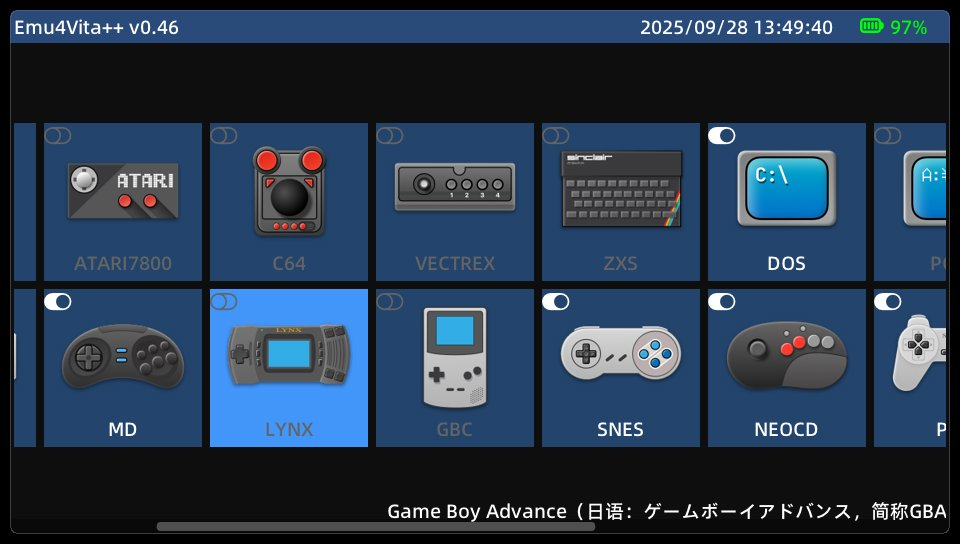
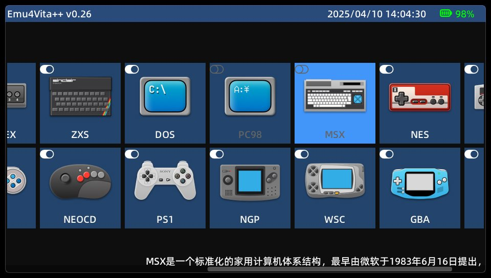
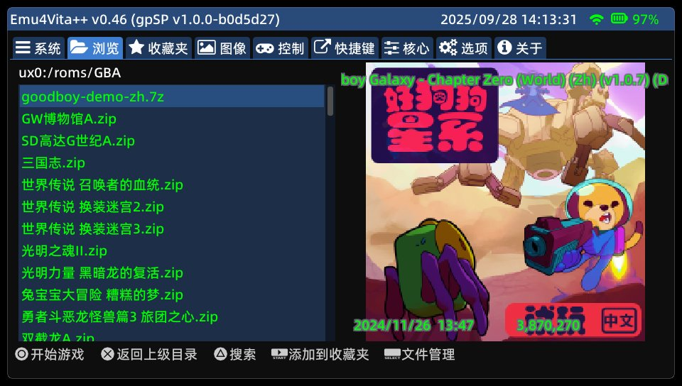
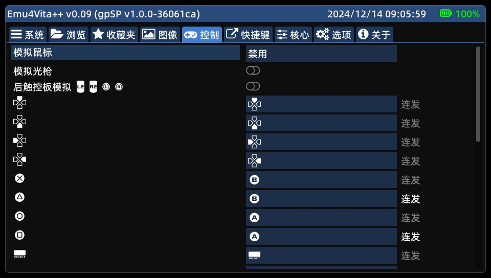
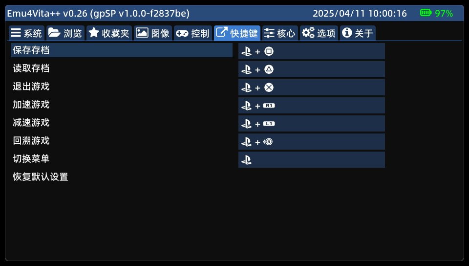
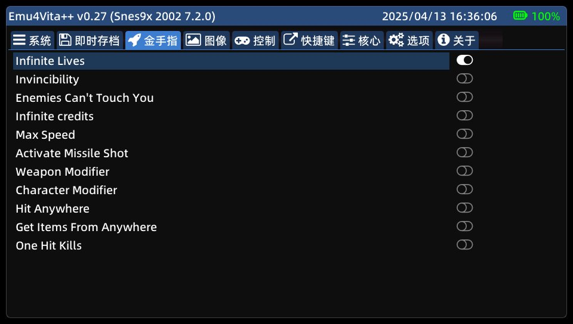
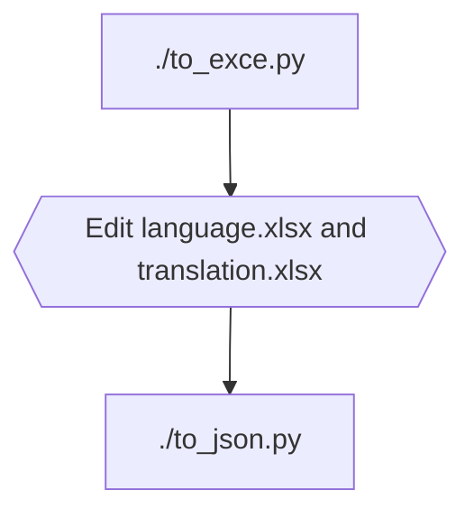

# Emu4Vita++
This is an emulator frontend for the PlayStation Vita, based on the [Libretro API](https://github.com/libretro/libretro-common).

# Download
[Release](https://github.com/noword/Emu4VitaPlus/releases)

The version with log will output more logs in `ux0:data/EMU4VITAPLUS/[core]/Emu4Vita++.log`

# Screenshots







## [overlay and shaders](GRAPHICS.md)

# Supported Cores
Arcade
  - [FinalBurn Lite](https://gitee.com/yizhigai/libretro-fba-lite)
  - [FinalBurn Alpha 2012](https://github.com/libretro/fbalpha2012)
  - [FinalBurn Neo](https://github.com/libretro/FBNeo)
  - [FinalBurn Neo Xtreme](https://github.com/KMFDManic/FBNeo-Xtreme-Amped)
  - [mame2003](https://github.com/libretro/mame2003-libretro)
  - [mame2003_plus](https://github.com/libretro/mame2003-plus-libretro)
  - [mame2003 Xtreme](https://github.com/KMFDManic/mame2003-xtreme)

NES
  - [FCEUmm](https://github.com/libretro/libretro-fceumm)
  - [Nestopia](https://github.com/libretro/nestopia)

SNES
  - [Snes9x 2002](https://github.com/libretro/snes9x2002)
  - [Snes9x 2005](https://github.com/libretro/snes9x2005)
  - [Snes9x 2010](https://github.com/libretro/snes9x2010)
  - [Supafaust](https://github.com/Rinnegatamante/supafaust)
  - [ChimeraSNES](https://github.com/jamsilva/chimerasnes)

MD
  - [Genesis Plus GX](https://github.com/libretro/Genesis-Plus-GX)
  - [Genesis Plus GX Wide](https://github.com/libretro/Genesis-Plus-GX-Wide)
  - [PicoDrive](https://github.com/libretro/picodrive)
  
GBC
  - [Gambatte](https://github.com/libretro/gambatte-libretro)
  - [TGB Dual](https://github.com/libretro/tgbdual-libretro.git)

GBA
  - [gpSP](https://github.com/libretro/gpsp)
  - [VBA Next](https://github.com/libretro/vba-next)
  - [mGBA](https://github.com/libretro/mgba.git)

PCE
  - [Mednafen PCE Fast](https://github.com/libretro/beetle-pce-fast-libretro)
  - [Mednafen SuperGrafx](https://github.com/libretro/beetle-supergrafx-libretro)

PS1
  - [PCSX ReARMed](https://github.com/libretro/pcsx_rearmed)

NEOCD
  - [NeoCD](https://github.com/libretro/neocd_libretro)

WSC
  - [Mednafen Wonderswan](https://github.com/libretro/beetle-wswan-libretro)

NGP
  - [Mednafen NeoPop](https://github.com/libretro/beetle-ngp-libretro)

DOS(测试中)
  - [DOS SVN](https://github.com/libretro/dosbox-svn)
  - [DOS Pure](https://github.com/libretro/dosbox-pure)

Atari 2600
  - [Stella 2014](https://github.com/libretro/stella2014-libretro)

Atari 5200
  - [Atari800](https://github.com/libretro/libretro-atari800)

Atari 7800
  - [ProSystem](https://github.com/libretro/prosystem-libretro)

Vectrex
  - [vecx](https://github.com/libretro/libretro-vecx)
  
Amiga
  - [uae4arm](https://github.com/libretro/uae4arm-libretro)

ZX Spectrum
  - [fuse](https://github.com/libretro/fuse-libretro)

PC98
  - [Neko Project II](https://github.com/libretro/libretro-meowPC98)
  
MSX
  - [Marat Fayzullin's fMSX](https://github.com/libretro/fmsx-libretro)
  - [blueMSX](https://github.com/libretro/blueMSX-libretro)

Commodore 64
 - [VICE](https://github.com/libretro/vice-libretro)

Sharp X68000
 - [PX68k](https://github.com/libretro/px68k-libretro)

# Pre-Compilation Preparation
## Windows
* Install [msys2](https://www.msys2.org/) or [devkitPro](https://github.com/devkitPro/installer/releases)
#### Enter msys
* Install [vitasdk](https://vitasdk.org/)
* Install cmake, python, ccache

  ```bash
  pacman -S cmake python python-pip ccache
  ```

* Install [openpyxl](https://pypi.org/project/openpyxl/), [pillow](https://pypi.org/project/pillow/), [lz4](https://pypi.org/project/lz4/)

  ```bash
  pip install openpyxl lz4
  ```

## Linux

Refer to the steps for Windows. If you're using Linux, you should be capable of figuring it out yourself.

# Compilation
```bash
mkdir build
cd build
cmake ../
make
```
Compiling a version with logs:
```bash
mkdir build-debug
cd build-debug
cmake ../ -DWITH_LOG=ON
make
```
Compiling a standalone core vpk:
```bash
mkdir build-gpsp
cd build-gpsp
cmake ../ -DBUILD=gpsp
make
```

# Scripts
## Translate



## Generate shaders
```bash
./compile_shaders.py  # Please search for psp2cgc.exe on the Internet
```

# Paths
## Previews
The program will automatically search for a `jpg` or `png` image with the same name in the `.previews` directory under the rom directory. If not found, it will search for the screenshots saved in instant state.

## Cheats
The program will find the .cht file of the same name as rom in the rom directory, the `.cheats` directory under the rom directory, and `ux0:/data/EMU4VITAPLUS/[core]/cheats` directory, whichever is found first.

## Save
ux0:/data/EMU4VITAPLUS/[core]/savefiles/[rom]

## BIOS
ux0:/data/EMU4VITAPLUS/system

copy the corresponding BIOS file to this directory【IMPORTANT】

# Compatible with [RetroArch romset](https://docs.libretro.com/guides/roms-playlists-thumbnails/)

Emu4Vita++ will try to read .lpl files in the following directories:
* ux0:data/EMU4VITAPLUS/playlists
* 'playlist_directory' item in ux0:data/retroarch/retroarch.cfg 
* ux0:data/retroarch/playlists
  
Use the label and path information in lpl to display the rom name and thumbnail.

# About Problem Reporting
If you wish to report a problem, please indicate the version and core used and the operation before the problem occurred; 

If the problem occurs during the game, please upload the ROM; 

If the program crashes, please find the psp2dmp file under ux0:/data/ and upload it.

# Special thanks
[yizhigai](https://gitee.com/yizhigai/Emu4Vita)

[KyleBing](https://github.com/KyleBing/retro-game-console-icons)

TearCrow

[yyoossk](https://github.com/yyoossk) (Japanese translation)

[theheroGAC](https://github.com/theheroGAC) (Italian translation)

[chronoss09](https://github.com/chronoss09) (French translation)

[limonetas](https://github.com/limonetas) (Spanish translation)

The developers of all open source software used in this project