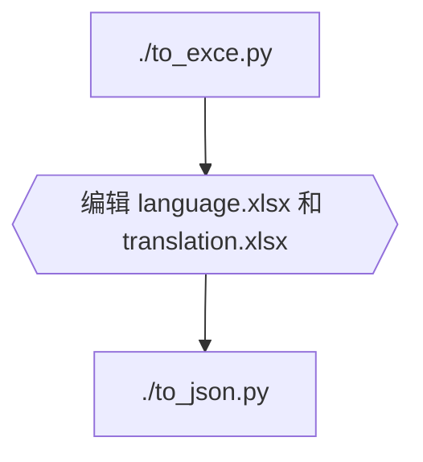

[For English](README.en.md)

# Emu4Vita++
这是一个在 PlayStation Vita 使用的, 基于 [Libretro API](https://github.com/libretro/libretro-common) 的模拟器前端。

# 下载
[Release](https://github.com/noword/Emu4VitaPlus/releases)

[百度网盘](https://pan.baidu.com/s/1chcOOw9G1GBtlkM9K4MtRg?pwd=E4VP)

带log的版本会在 `ux0:data/EMU4VITAPLUS/[core]/Emu4Vita++.log` 中输出更多日志，但是会影响执行效率。

# 问题反馈
[https://github.com/noword/Emu4VitaPlus/issues](https://github.com/noword/Emu4VitaPlus/issues)

QQ群：550802386

# 截屏


## [遮罩和着色器](GRAPHICS.md)


# 支持的内核
街机
  - [FinalBurn Lite](https://gitee.com/yizhigai/libretro-fba-lite)
  - [FinalBurn Alpha 2012](https://github.com/libretro/fbalpha2012)
  - [FinalBurn Neo](https://github.com/libretro/FBNeo)
  - [FinalBurn Neo Xtreme](https://github.com/KMFDManic/FBNeo-Xtreme-Amped)
  - [mame2003](https://github.com/libretro/mame2003-libretro)
  - [mame2003_plus](https://github.com/libretro/mame2003-plus-libretro)
  - [mame2003 Xtreme](https://github.com/KMFDManic/mame2003-xtreme)

NES
  - [FCEUmm](https://github.com/libretro/libretro-fceumm)
  - [Nestopia](https://github.com/libretro/nestopia)

SNES
  - [Snes9x 2002](https://github.com/libretro/snes9x2002)
  - [Snes9x 2005](https://github.com/libretro/snes9x2005)
  - [Snes9x 2010](https://github.com/libretro/snes9x2010)
  - [Supafaust](https://github.com/Rinnegatamante/supafaust)
  - [ChimeraSNES](https://github.com/jamsilva/chimerasnes)

MD
  - [Genesis Plus GX](https://github.com/libretro/Genesis-Plus-GX)
  - [Genesis Plus GX Wide](https://github.com/libretro/Genesis-Plus-GX-Wide)
  - [PicoDrive](https://github.com/libretro/picodrive)
  
GBC
  - [Gambatte](https://github.com/libretro/gambatte-libretro)
  - [TGB Dual](https://github.com/libretro/tgbdual-libretro.git)

GBA
  - [gpSP](https://github.com/libretro/gpsp)
  - [VBA Next](https://github.com/libretro/vba-next)
  - [mGBA](https://github.com/libretro/mgba.git)

PCE
  - [Mednafen PCE Fast](https://github.com/libretro/beetle-pce-fast-libretro)
  - [Mednafen SuperGrafx](https://github.com/libretro/beetle-supergrafx-libretro)

PS1
  - [PCSX ReARMed](https://github.com/libretro/pcsx_rearmed)

NEOCD
  - [NeoCD](https://github.com/libretro/neocd_libretro)

WSC
  - [Mednafen Wonderswan](https://github.com/libretro/beetle-wswan-libretro)

NGP
  - [Mednafen NeoPop](https://github.com/libretro/beetle-ngp-libretro)

DOS
  - [DOS Pure](https://github.com/libretro/dosbox-pure)

Atari 2600
  - [Stella 2014](https://github.com/libretro/stella2014-libretro)

Atari 5200
  - [Atari800](https://github.com/libretro/libretro-atari800)

Atari 7800
  - [ProSystem](https://github.com/libretro/prosystem-libretro)

Vectrex
  - [vecx](https://github.com/libretro/libretro-vecx)
  
Amiga
 - [uae4arm](https://github.com/libretro/uae4arm-libretro)

ZX Spectrum
 - [fuse](https://github.com/libretro/fuse-libretro)

PC98
 - [Neko Project II](https://github.com/libretro/libretro-meowPC98)
  
MSX
 - [Marat Fayzullin's fMSX](https://github.com/libretro/fmsx-libretro)
 - [blueMSX](https://github.com/libretro/blueMSX-libretro)

# 编译前准备
## Windows
* 安装 [msys2](https://www.msys2.org/) 或 [devkitPro](https://github.com/devkitPro/installer/releases)
#### 进入 msys
* 安装 [vitasdk](https://vitasdk.org/)
* 安装 cmake, python, ccache
  
  ```bash
  pacman -S cmake python python-pip ccache
  ```

* 安装 [openpyxl](https://pypi.org/project/openpyxl/), [pillow](https://pypi.org/project/pillow/), [lz4](https://pypi.org/project/lz4/)
  

  ```bash
  pip3 install openpyxl pillow pz4
  ```

## Linux

参考 Windows 的步骤，都用 Linux 了，应该有能力自己捣鼓了。

# 编译
```bash
mkdir build
cd build
cmake ../
make
```
编译带日志的版本:
```bash
mkdir build-debug
cd build-debug
cmake ../ -DWITH_LOG=ON
make
```
编译独立内核的vpk:
```bash
mkdir build-gpsp
cd build-gpsp
cmake ../ -DBUILD=gpsp
make
```

# 相关脚本
## 翻译



## 生成 shaders
```bash
./compile_shaders.py  #请自行在网上寻找 psp2cgc.exe
```

# 相关路径
## 预览图
程序会在 rom 目录下的 `.previews` 目录中自动寻找同名的 `jpg` 或 `png` 图片，如果未找到，则会搜寻即时存档的截图

## 金手指
程序会依次在 rom 目录下，rom目录下的.cheats 目录，ux0:/data/EMU4VITAPLUS/[内核]/cheats 目录下的同名.cht文件，以先找到的为准。

## 遮罩
程序会读取 ux0:/data/EMU4VITAPLUS/[内核]/overlays 下的 overlays.ini

## 存档
ux0:/data/EMU4VITAPLUS/[内核]/savefiles/[rom]

## BIOS
ux0:/data/EMU4VITAPLUS/system

请自行将对应的 BIOS 文件复制到此目录中【重要】

# 兼容 [RetroArch romset](https://docs.libretro.com/guides/roms-playlists-thumbnails/)

Emu4Vita++ 会尝试读取以下目录中的 .lpl 文件:
* ux0:data/EMU4VITAPLUS/playlists
* ux0:data/retroarch/retroarch.cfg 中的 playlist_directory 项
* ux0:data/retroarch/playlists
  
利用 lpl 中的 label 和 path 信息，显示 rom 名称和缩略图。

# 关于问题报告
如果希望回报问题，请注明版本和使用的内核，问题出现前的操作；

如果在游戏过程中出现问题，请上传rom；

如果程序奔溃，请找到ux0:/data/下面的psp2dmp文件，并上传。


# 特别感谢
[一直改](https://gitee.com/yizhigai/Emu4Vita)

[KyleBing](https://github.com/KyleBing/retro-game-console-icons)

TearCrow

以及在本项目中用到的所有开源项目的开发者们